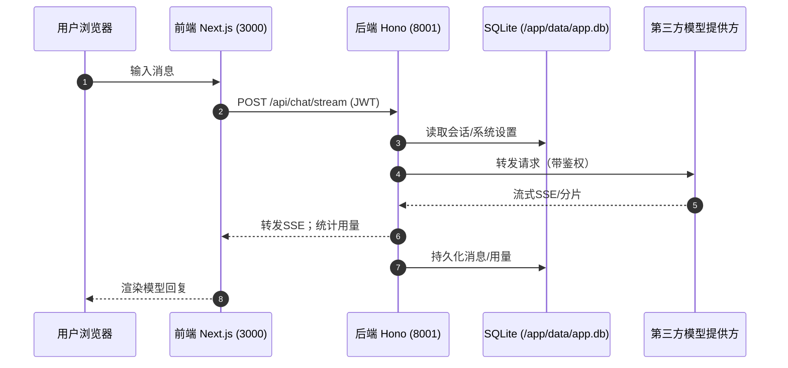

# AI Chat Platform

轻量级 AI 聊天平台（后端 Hono + SQLite，前端 Next.js）。本文档仅保留两种最简部署方式：

- CI 镜像 + 1Panel（推荐）
- 本地运行（开发 / 非 Docker 生产）

---

## 一、CI 镜像 + 1Panel 部署（推荐）

前提
- 镜像已由 GitHub Actions 推送到 GHCR：
  - 后端：`ghcr.io/asheblog/aichat-backend:latest`
  - 前端：`ghcr.io/asheblog/aichat-frontend:latest`
- 若包是私有，需先在服务器执行 `docker login ghcr.io -u asheblog -p <PAT>`（PAT 至少具备 `read:packages`）。

在 1Panel 的“编排 → 新建 → 编辑”中粘贴以下 Compose（示例端口：前端 3555，后端 3556，可按需修改左侧宿主端口）：

```
version: '3.8'

services:
  backend:
    image: ghcr.io/asheblog/aichat-backend:latest
    container_name: ai-chat-web-ui-backend
    environment:
      - NODE_ENV=production
      - PORT=8001
      - DATABASE_URL=file:./data/app.db
      - JWT_SECRET=请改成强随机密码 #这里要改
      - APP_MODE=single
      - DEFAULT_CONTEXT_TOKEN_LIMIT=120000 #这里后面大概率就要废弃的
      - ENABLE_CORS=true #不要cors就关了
      - CORS_ORIGIN=http://你的IP或域名:3555
      - LOG_LEVEL=info
      - DB_INIT_ON_START=true #首次部署结束后记得进入编排修改为false或删除，避免重复播种
    volumes:
      - backend_data:/app/data
      - backend_logs:/app/logs
      - 你服务器数据库目录地址/app.db:/app/data/app.db #常态化数据库，这里要改成你服务器数据库目录地址
    ports:
      - "3556:8001" #后端端口可以改 
    restart: unless-stopped
    healthcheck:
      test: ["CMD-SHELL", "curl -fsS http://localhost:8001/api/settings/health > /dev/null || exit 1"]
      interval: 30s
      timeout: 10s
      retries: 3
      start_period: 40s
    networks:
      - ai-chat-web-ui-network

  frontend:
    image: ghcr.io/asheblog/aichat-frontend:latest
    container_name: ai-chat-web-ui-frontend
    environment:
      - NODE_ENV=production
      - NEXT_PUBLIC_API_URL=/api
      - BACKEND_HOST=backend
      - BACKEND_INTERNAL_PORT=8001
    depends_on:
      backend:
        condition: service_healthy
    ports:
      - "3555:3000" #前端端口可以改
    restart: unless-stopped
    healthcheck:
      test: ["CMD", "curl", "-f", "http://localhost:3000/api/health"]
      interval: 30s
      timeout: 10s
      retries: 3
      start_period: 30s
    networks:
      - ai-chat-web-ui-network

volumes:
  backend_data:
    driver: local
    name: ai_chat_web_ui_db_data
  backend_logs:
    driver: local
    name: ai_chat_web_ui_logs

networks:
  ai-chat-web-ui-network:
    driver: bridge
    name: ai_chat_web_ui_network
```

首次初始化
- 新镜像已内置自动初始化：若容器启动时未发现 `/app/data/app.db`，会自动执行 `prisma db push` 初始化数据库，并修复卷权限；通常无需手动建表。
- 如需手动：在 1Panel 进入 `ai-chat-web-ui-backend` 容器终端，执行：`npm run db:push`。
- 若希望自动播种默认数据，可在 1Panel 编排中临时加入环境变量 `DB_INIT_ON_START=true`，首次启动观察后台日志确认 `npm run db:init` 执行成功后再移除/改回默认值，避免重复播种。
- 初始化完成后，访问前端 `http://你的IP或域名:3555`，注册第一个账号（single 模式下为管理员）。

关键配置要点
- `JWT_SECRET`：务必改为 32 位以上强密码。
- `CORS_ORIGIN`：填写前端实际访问地址（含协议+端口）。
- 端口：`"宿主机端口:容器端口"`，容器内固定后端 8001、前端 3000。
- 升级/回滚：把镜像标签从 `latest` 改为某次构建的 commit SHA 标签，更新/重建即可；回滚就是切回旧标签。

健康检查
- 前端：`http://你的IP或域名:3555/api/health`
- 后端：`http://你的IP或域名:3556/api/settings/health`

---

## 二、本地运行（不使用 Docker）

前提
- Node.js ≥ 18；首次运行建议复制根目录 `.env.example` 为 `.env` 并按需修改（`JWT_SECRET`、`CORS_ORIGIN` 等）。

命令
- 开发环境（热更新）：`npm run start:dev`
- 非 Docker 的生产运行：`npm run start:prod`

数据库初始化（首次）
- 进入 `packages/backend`，执行一次：`npm run db:push`

---

## 项目结构

```
aichat/
├── .github/
│   └── workflows/
│       └── docker-images.yml       # GH Actions：构建并推送前后端镜像
├── packages/
│   ├── backend/                    # 后端（Hono + Prisma + SQLite）
│   │   ├── src/                    # API、路由、中间件
│   │   ├── prisma/                 # Prisma schema 与 seed/迁移脚本
│   │   └── Dockerfile              # 后端镜像
│   └── frontend/                   # 前端（Next.js 14）
│       ├── src/
│       └── Dockerfile              # 前端镜像（standalone 运行）
├── scripts/                        # 辅助脚本（本地/调试）
├── README.md
 └── docs/                           # 文档（可选）
```

数据持久化
- SQLite 数据文件位于容器内 `/app/data/app.db`，通过 compose 中的 `backend_data` 卷（或你自定义的宿主机路径）持久化。

---

## 移动端/平板端适配（/m 路由）

- 自动跳转：基于 UA 的中间件判断设备类型（手机/平板），
  - 访问 `/main` 将自动重定向到 `/m/main`；
  - 桌面访问 `/m/main` 将自动跳回 `/main`。
- 独立组件：移动端页面与布局独立于桌面端，路径在：
  - `packages/frontend/src/app/m/main/page.tsx`
  - `packages/frontend/src/app/m/main/layout.tsx`
  - 复用逻辑但采用更适合移动端的 UI：`packages/frontend/src/components/mobile/mobile-chat.tsx`
- 设计参考：`packages/frontend/previews/mobile-variant-a-shadcn.html`
- 设置页：`/m/main/settings` 与桌面功能一致，沿用相同的设置组件。

显式切换（Cookie 覆盖 UA）
- 登录前：
  - 桌面登录/注册页底部有“使用移动版”，点击后设置 `viewMode=mobile` 并跳转 `/m/auth/login` 或 `/m/auth/register`。
  - 移动登录/注册页底部有“切换到桌面版”，点击后设置 `viewMode=desktop` 并跳转至 `/auth/*`。
- 登录后：
  - 侧边栏用户菜单新增“切换到移动版”项（设 `viewMode=mobile`，跳转 `/m/main`）。
  - 移动端顶部栏提供“桌面版”按钮（设 `viewMode=desktop`，跳转 `/main`）。
- 中间件读取 `viewMode` Cookie 优先于 UA，用于在 `/main*` 与 `/m/main*` 之间重定向。

移动端视觉细化
- 登录/注册采用更大圆角与更强阴影（`rounded-3xl shadow-xl`），留白与字号层级更接近设计稿。
- 移动聊天页：
  - 顶部提供紧凑 `ModelSelector`；
  - 输入区为 `rounded-2xl border bg-card shadow-sm` 卡片；
  - 操作按钮使用圆形图标按钮与圆角“发送”按钮，简洁一致。

---

## 业务流程图



---

## 常见问题（简）

- 无法拉取镜像：GHCR 包设为 Public，或在服务器 `docker login ghcr.io -u asheblog -p <PAT>`。
- 跨域报错：确认 `CORS_ORIGIN` 与前端访问地址一致（协议+端口）。
- 首次注册失败：`APP_MODE=single` 下仅首个用户可注册；多用户改为 `multi` 并在系统设置开启注册。

---

许可证：MIT（见 LICENSE）。
