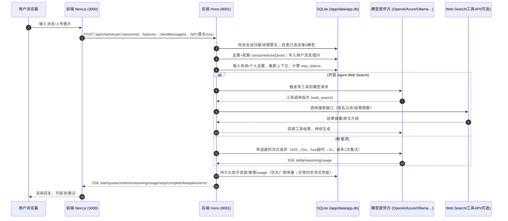

# AI Chat 聊天平台
---

轻量级 AI 聊天平台（后端 Hono + SQLite，前端 Next.js）。本文档仅保留两种最简部署方式。

示例网站：https://aichat.asheblog.org

- CI 镜像 + 1Panel（推荐）
- 本地运行（开发 / 非 Docker 生产）

## ✨ 核心能力速览

| 模块 | 主要能力 | 亮点 |
| --- | --- | --- |
| 聊天体验 | SSE 实时对话、会话管理、Markdown 渲染、图片/头像上传 | Web Worker Markdown 管线 + `@tanstack/react-virtual` 虚拟滚动，气泡推理展开、复制/重试、移动端抽屉式布局，发送失败自动回滚所选图片（后端持久化到 `storage/chat-images`），并可在关闭页面后保留后台任务直至生成完成。 |
| 模型与推理 | 系统模型、个人偏好、模型目录缓存 | System Connections 把 OpenAI/Azure/Ollama/Google Generative AI 等统一纳入，支持能力标签、Base URL 校验与连接校验；动态上下文窗口/补全限制、`ollamaThink` 与 OpenAI Reasoning Effort；内置 OpenAI 兼容 API 与模型选择器记忆。 |
| 权限与配额 | 注册审批、角色治理、匿名访客、每日额度 | 首位注册者自动成为管理员，其余待审批；匿名 Cookie + retention days，系统设置可区分匿名/注册每日额度并一键重置；模型访问策略允许对匿名/注册用户设置 allow/deny。 |
| 系统设置 | 设置中心、连接/模型管理、品牌化 | 系统/个人设置分区包含通用、网络、模型、推理、日志、图片、品牌等卡片；连接管理支持能力开关、Tags/Prefix、验证按钮；欢迎页品牌文案、LOGO、主题/图片域名均可后台修改。 |
| 运维与可观测 | Task Trace、用量统计、部署脚本 | Task Trace Console 记录 `/api/chat/stream` 生命周期并支持导出；SSE `usage` 事件 + `usage_quota` 表提供 token 聚合；健康检查、SSE 心跳、全链路 `traffic-logger`；CI 构建前/后端镜像、1Panel Compose、自动 Prisma init、`start.sh/start.bat` 跨平台脚本。 |

## 🌟 亮点特性

- **细腻的流式聊天体验**  Web Worker Markdown 渲染结合 `@tanstack/react-virtual` 虚拟列表，长会话仍保持 60fps；消息气泡支持推理片段折叠、逐字动画、复制/重试；输入区支持多图片上传，失败会回滚队列，文件由后端保存到 `storage/chat-images` 并可配置公开域名；桌面三段式/平板收缩/手机抽屉保证多端一致。
- **多源模型连接与动态目录**  System Connections 将 OpenAI、Azure OpenAI、Ollama、Google Generative AI 等通道统一抽象，支持 Tags、能力开关、Prefix、Base URL 校验及“验证连接”按钮；模型目录缓存会自动刷新上下文窗口/补全限制，管理员可手动刷新或覆写，前端的模型选择器会记住匿名/登录偏好，还提供 OpenAI 兼容接口以便外部客户端直接调用。
- **推理 & 工具链编排**  Chat Request Builder 会根据模型元数据动态扩展上下文、调整 max_tokens，结合 `ollamaThink` / OpenAI Reasoning Effort 控制推理；Agent Web Search 能在流式过程中记录工具事件与检索命中，必要时调用外部搜索 API；后端为 429/5xx/超时提供退避+重试，并在流式失败且无增量时自动降级为非流式 completion，最大程度保证可用性。
- **匿名访客 + 审批制治理**  注册审批流程替代旧的 `APP_MODE`，管理员可在后台审批/禁用用户；匿名访客通过 Cookie 拿到独立 session 和保留天数，系统设置可单独设定匿名/注册的每日额度并支持“同步重置”；模型访问策略（inherit/allow/deny）让敏感模型只对指定人群开放，避免匿名滥用资源。
- **全链路可观测**  Task Trace Console（`/main/logs/task-trace`）记录 stream key、工具事件、错误堆栈并支持筛选与 TXT 导出；SSE `usage`、`reasoning`、`keepalive` 事件实时反馈 token、推理时长与静默提示；`traffic-logger` 与 `/api/settings/health`、日志卷让排障透明，还能在输入框通过“任务追踪”按钮临时打开全链路追踪。
- **后台任务不中断**  SSE 流同 Task Trace、消息持久化配合，让服务器在你关闭浏览器或网络掉线后仍会完成推理；重新打开页面即可从同一会话恢复，避免 OpenWebUI 等本地方案常见的“页面关闭即中断”问题。
- **即插即用的部署体验**  官方 CI 每次推送都会产出前后端镜像（ghcr.io），1Panel Compose 已内置健康检查/卷/互信网络；容器首次启动自动执行 `prisma db push` + 可选 `db:init`；`.env.example` 统一管理变量，`start.sh`/`start.bat` 方便 Linux/Windows 一键启动；图片/日志/数据库卷路径可按需覆盖，系统设置里还能配置品牌文案/图片域名/推理默认策略以满足企业定制。

---

## 一、CI 镜像 + 1Panel 部署（推荐）

前提
- 镜像已由 GitHub Actions 推送到 GHCR：
  - 后端：`ghcr.io/asheblog/aichat-backend:latest`
  - 前端：`ghcr.io/asheblog/aichat-frontend:latest`
- 若包是私有，需先在服务器执行 `docker login ghcr.io -u asheblog -p <PAT>`（PAT 至少具备 `read:packages`）。

在 1Panel 的“编排 → 新建 → 编辑”中粘贴以下 Compose（示例端口：前端 3555，后端 3556，可按需修改左侧宿主端口）：

```
version: '3.8'

services:
  backend:
    image: ghcr.io/asheblog/aichat-backend:latest
    container_name: ai-chat-web-ui-backend
    environment:
      - NODE_ENV=production
      - PORT=8001
      - DATABASE_URL=file:/app/data/app.db
      - JWT_SECRET=请改成强随机密码 #这里要改
      - DEFAULT_REGISTRATION_ENABLED=true
      - DEFAULT_CONTEXT_TOKEN_LIMIT=120000 #这里后面大概率就要废弃的
      - ENABLE_CORS=true #不要cors就关了
      - CORS_ORIGIN=http://你的IP或域名:3555
      - LOG_LEVEL=info
      - DB_INIT_ON_START=true #首次部署结束后记得进入编排修改为false或删除，避免重复播种
    volumes:
      - backend_data:/app/data
      - backend_logs:/app/logs
      - backend_images:/app/storage/chat-images
    ports:
      - "3556:8001" #后端端口可以改
    restart: unless-stopped
    healthcheck:
      test: ["CMD-SHELL", "curl -fsS http://localhost:8001/api/settings/health > /dev/null || exit 1"]
      interval: 30s
      timeout: 10s
      retries: 3
      start_period: 40s
    networks:
      ai-chat-web-ui-network:
        aliases:
          - backend

  rag-worker:
    image: ghcr.io/asheblog/aichat-backend:latest
    container_name: ai-chat-web-ui-rag-worker
    environment:
      - NODE_ENV=production
      - DATABASE_URL=file:/app/data/app.db
      - JWT_SECRET=请改成强随机密码 #与backend保持一致
      - LOG_LEVEL=info
      - NODE_OPTIONS=--max-old-space-size=1024
    volumes:
      - backend_data:/app/data
      - backend_logs:/app/logs
      - backend_images:/app/storage/chat-images
    depends_on:
      backend:
        condition: service_healthy
    restart: unless-stopped
    networks:
      - ai-chat-web-ui-network
    working_dir: /app/packages/backend
    command: ["node", "dist/workers/document-worker.js"]

  frontend:
    image: ghcr.io/asheblog/aichat-frontend:latest
    container_name: ai-chat-web-ui-frontend
    environment:
      - NODE_ENV=production
      - NEXT_PUBLIC_API_URL=/api
      - BACKEND_HOST=backend
      - BACKEND_INTERNAL_PORT=8001
    depends_on:
      backend:
        condition: service_healthy
    ports:
      - "3555:3000" #前端端口可以改
    restart: unless-stopped
    healthcheck:
      test: ["CMD", "curl", "-f", "http://localhost:3000/api/health"]
      interval: 30s
      timeout: 10s
      retries: 3
      start_period: 30s
    networks:
      - ai-chat-web-ui-network

volumes:
  backend_data:
    driver: local
    name: ai_chat_web_ui_db_data
  backend_logs:
    driver: local
    name: ai_chat_web_ui_logs
  backend_images:
    driver: local
    name: ai_chat_web_ui_images

networks:
  ai-chat-web-ui-network:
    driver: bridge
    name: ai_chat_web_ui_network
```

首次初始化
- 新镜像已内置自动初始化：若容器启动时未发现 `/app/data/app.db`，会自动执行 `prisma db push` 初始化数据库，并修复卷权限；通常无需手动建表。
- 如需手动：在 1Panel 进入 `ai-chat-web-ui-backend` 容器终端，执行：`npm run db:push`。
- 若希望自动播种默认数据，可在 1Panel 编排中临时加入环境变量 `DB_INIT_ON_START=true`，首次启动观察后台日志确认 `npm run db:init` 执行成功后再移除/改回默认值，避免重复播种。
- 初始化完成后，访问前端 `http://你的IP或域名:3555`，注册第一个账号（single 模式下为管理员）。

关键配置要点
- `JWT_SECRET`：务必改为 32 位以上强密码。
- `CORS_ORIGIN`：填写前端实际访问地址（含协议+端口）。
- 图片存储：`CHAT_IMAGE_DIR` 默认指向 `/app/storage/chat-images`。Compose 中的 `backend_images:/app/storage/chat-images` 会将聊天图片与头像持久化到宿主卷；若需使用其他目录，请同时调整 `CHAT_IMAGE_DIR` 与卷挂载路径。
- 端口：`"宿主机端口:容器端口"`，容器内固定后端 8001、前端 3000。
- 升级/回滚：把镜像标签从 `latest` 改为某次构建的 commit SHA 标签，更新/重建即可；回滚就是切回旧标签。
- `SYSTEM_PROMPT_MAX_LENGTH`：控制会话/全局系统提示词的最大字符数（默认 12000）。提示词会被持久化并在每次请求中附加，过长不仅会显著拖慢序列化/数据库写入，还可能触发上游模型的上下文上限，因此仍需上限约束；如确有长提示词需求，可在后端容器中通过该变量（或兼容的 `SESSION_PROMPT_MAX_CHARS`、`CHAT_SYSTEM_PROMPT_MAX_CHARS`）自行调大，硬封顶 100000 字符，修改后重启即可生效。

健康检查
- 前端：`http://你的IP或域名:3555/api/health`
- 后端：`http://你的IP或域名:3556/api/settings/health`

版本更新
- 1panel部署的话，直接在面板拉取最新镜像重启容器即可。
- **如果涉及数据库更新，请阅读 CHANGLOG.MD文件，注意升级命令。**

---

## 二、本地运行（不使用 Docker）

前提
- Node.js ≥ 18；首次运行建议复制根目录 `.env.example` 为 `.env` 并按需修改（`JWT_SECRET`、`CORS_ORIGIN` 等）。

命令
- 开发环境（热更新）：`npm run start:dev`
- 非 Docker 的生产运行：`npm run start:prod`

数据库初始化（首次）
- 进入 `packages/backend`，执行一次：`npm run db:push`

---

## 项目结构

```
aichat/
├── docker-compose.yml               # 生产部署 Compose
├── docker-compose.dev.yml           # 开发/本地 Compose
├── packages/
│   ├── backend/                     # 后端（Hono + Prisma + SQLite）
│   │   ├── src/                     # 路由/中间件/模块/服务
│   │   │   ├── api/                 # auth/users/chat/... 路由
│   │   │   ├── modules/chat/        # 聊天流/Agent/用量/推理
│   │   │   ├── services/            # 会话/连接/配额等服务
│   │   │   └── middleware/          # 认证/错误处理
│   │   ├── prisma/                  # schema 与 seed/迁移
│   │   ├── docker/                  # 本地/调试脚本
│   │   └── Dockerfile
│   └── frontend/                    # 前端（Next.js 14）
│       ├── src/
│       │   ├── app/                 # 页面路由
│       │   ├── components/          # UI 组件
│       │   ├── lib/                 # API 客户端与工具
│       │   ├── store/               # 状态管理
│       │   └── workers/             # Web Worker
│       └── Dockerfile
├── scripts/                         # 辅助脚本
├── docs/                            # 文档/截图
├── start.sh / start.bat             # 便捷启动
├── README.md
└── 构建命令.txt
```

### 前端模块化约定

- `packages/frontend/src/features/{chat,auth,settings,share,system}/api.ts` 拆分为按领域的 API 层，不再直接引用 `lib/api`。`lib/api.ts` 仅负责创建 Axios 单例与未授权处理。
- `packages/frontend/src/features/chat/store` 继续保持 slice + runtime 结构，流式/usage/message 等模块之间只共享显式的 util。
- Task Trace 控件拆分为 `TaskTraceConsole.tsx + TaskTraceDetailDialog.tsx + TaskTraceTable.tsx`，利于后续拓展分页/筛选。

### 行数守卫脚本

- `pnpm lint:lines`：扫描 `packages/frontend/src/**/*.{ts,tsx}`，超出 `--max 300` 行或平均 `--avg 150` 行即失败，可在迁移期通过 `--whitelist="<glob>"` 豁免旧文件。
- 命令输出会列出超限文件（按行数降序），阶段性 refactor 完成后请更新 `解耦计划.md` 并在 PR 说明中附上剩余清单。
- 典型使用：`pnpm lint:lines`、`pnpm lint:lines --whitelist "features/chat/store/runtime.ts"`。

数据持久化
- SQLite 数据文件位于容器内 `/app/data/app.db`，通过 compose 中的 `backend_data` 卷（或你自定义的宿主机路径）持久化。

---

## 业务流程图


---

## 部分图片预览


---

## 常见问题（简）

- 无法拉取镜像：GHCR 包设为 Public，或在服务器 `docker login ghcr.io -u asheblog -p <PAT>`。
- 跨域报错：确认 `CORS_ORIGIN` 与前端访问地址一致（协议+端口）。
- 首次注册失败：请在系统设置「通用」页确认“允许注册”开关已开启；默认情况下首个注册者会成为管理员，其余用户需管理员审批。
- 图片 URL 指向 localhost：在系统设置「通用」页填写“图片访问域名”并保存，随后点击“刷新图片链接”即可生成新域名样例；如留空则会根据请求头或局域网 IP 自动推断（便于本地调试）。
- 文字 LOGO 仍显示默认 `AIChat`：确保系统设置中已保存“文字 LOGO”，若容器刚更新，前端会自动轮询 `/api/settings/branding`，无需手动重启即可恢复自定义名称。

## 任务追踪（Task Trace）

后台可选记录 `/api/chat/stream` 生命周期，全链路追踪请求/工具事件/错误，辅助排障：

1. **执行数据库迁移**：`pnpm --filter backend prisma migrate deploy`（或 `prisma migrate deploy`）以创建 `task_traces` / `task_trace_events` 表。
2. **开启开关**：管理员登录前端后进入 `设置 → 系统 → 日志与监控`，配置“启用任务追踪 / 默认开启 / 仅限管理员 / 可用环境 / 保留天数”。
3. **查看与导出**：`/main/logs/task-trace` 列出所有追踪，支持筛选、详情（首 2000 条事件）与 TXT 导出，对应 API：
   - `GET /api/task-trace`：分页列表
   - `GET /api/task-trace/:id`：详情 + 事件
   - `GET /api/task-trace/:id/export`：TXT 导出
   - `POST /api/task-trace/cleanup`：按保留天数批量清理
4. **输入框快速开关**：管理员在聊天输入框侧栏可通过“任务追踪”按钮临时开启/关闭单次追踪。

---

许可证：MIT（见 LICENSE）。
