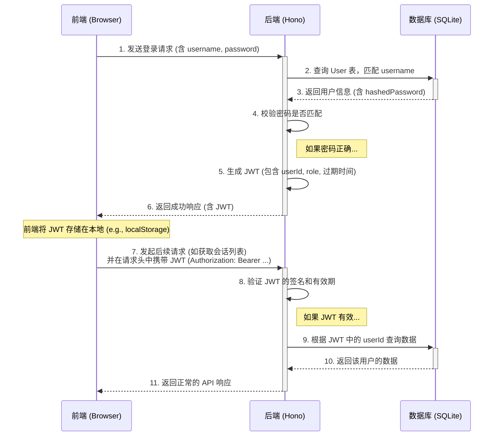
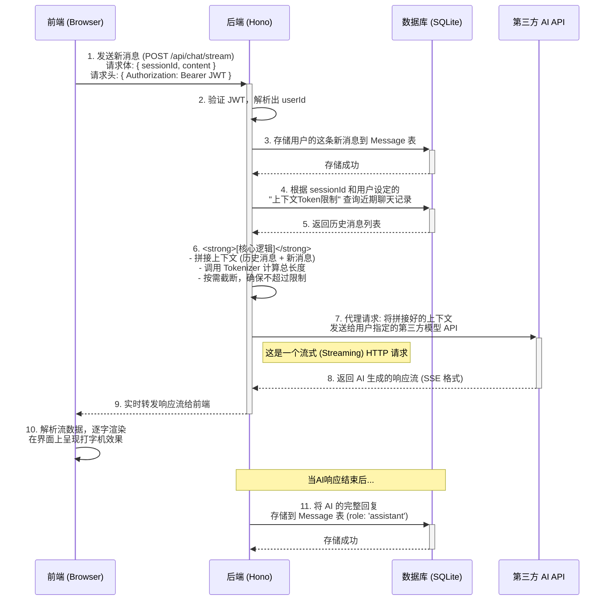

# AI 聊天平台 - 系统架构文档 (Architecture.md)

| **文档版本** | **V1.0 (Final)** | **关联PRD版本** | **V1.6 (Final)** |
| :--- | :--- | :--- | :--- |
| **创建者** | Gemini & (您的名字) | **状态** | 已完成 |

## 1. 概述 (Overview)

本文档基于 `PRD.md` V1.6 版本，旨在提供对 AI 聊天平台系统架构的详细技术阐述。它定义了系统的核心组件、它们之间的交互关系、数据流、技术选型以及部署策略，作为后续开发和维护的权威技术指南。

## 2. 架构设计原则 (Architectural Principles)

在技术选型和系统设计的每一个环节，我们都遵循以下核心原则：

*   **1. 极致轻量 (Lightweight):** **低内存和低CPU占用**是最高优先级。所有技术选型（Hono, SQLite）和服务设计都必须服务于此目标，确保应用在资源有限的环境下也能高效运行。
*   **2. 简洁易维 (Simplicity & Maintainability):** 采用前后端分离、职责单一的组件设计。代码应高度模块化，并借助 TypeScript 的类型系统来保证健壮性和可维护性。
*   **3. 易于部署 (Deployability):** 以 Docker 为核心，实现“一次构建，处处运行”。目标是让非专业用户也能通过一行命令完成整个应用的部署和启动。
*   **4. 面向未来 (Future-Ready):** 架构设计应具备良好的扩展性，能够平滑地支持 V2.0 规划中的“长期记忆”和“多模态”等功能，而无需进行颠覆性重构。

## 3. 高层架构 (High-Level Architecture)

本系统采用经典、成熟的**前后端分离**架构模式。这种模式将用户界面（前端）和业务逻辑/数据处理（后端）完全解耦，带来了极大的灵活性和可维护性。

### 3.1 系统组件 (System Components)

系统由以下三个核心组件构成：

| 组件 | 技术栈 | 核心职责 |
| :--- | :--- | :--- |
| **1. 前端 (Frontend)** | `Next.js` / `TypeScript` / `Tailwind CSS` | - **用户交互界面:** 渲染所有页面，包括聊天窗口、设置页、登录页等。<br>- **状态管理:** 负责管理UI状态，如会话列表、当前消息等。<br>- **API 客户端:** 向后端发起HTTP请求，获取数据和发送用户指令。 |
| **2. 后端 (Backend)** | `Hono` / `TypeScript` / `Prisma` | - **API 服务:** 提供RESTful API接口供前端调用。<br>- **业务逻辑:** 处理用户注册、登录、会话管理、上下文拼接等核心逻辑。<br>- **安全与认证:** 验证用户身份，确保数据隔离。<br>- **AI模型代理:** 作为中间层，安全地调用用户配置的第三方AI模型API。 |
| **3. 数据库 (Database)** | `SQLite` | - **数据持久化:** 存储所有应用数据，包括用户信息、模型配置、聊天记录和系统设置。<br>- **单一数据源:** 作为系统唯一可信的数据来源。 |

### 3.2 架构图 (Component Diagram)

下图直观地展示了各组件之间的交互关系和网络边界。

```mermaid
graph TD
    subgraph "用户设备 (浏览器)"
        A[前端应用 (Next.js)]
    end

    subgraph "服务器 (Docker 容器)"
        B[后端API (Hono)]
        C[(SQLite数据库文件)]
    end

    subgraph "外部云服务"
        D[第三方AI模型 API]
    end

    A -- "1. HTTP API 请求 (JSON)" --> B
    B -- "2. 数据库读写 (Prisma)" --> C
    B -- "3. 代理API请求" --> D
    D -- "4. AI 响应" --> B
    B -- "5. HTTP API 响应 (JSON / Stream)" --> A

    style C fill:#d6f5d6,stroke:#333,stroke-width:2px
```

## 4. 核心数据流 (Core Data Flows)

本章节详细描述了两个关键业务场景的数据流动过程。

### 4.1 用户认证流程 (User Authentication Flow)

此流程描述了用户从登录到可以正常访问应用的完整过程。我们采用 **JWT (JSON Web Token)** 方案进行认证，这是一种无状态、适合前后端分离架构的认证机制。



### 4.2 聊天消息处理流程 (Chat Message Processing Flow)

此流程描述了从用户发送一条消息到接收到 AI 完整回复的全过程。



## 5. 目录结构 (Directory Structure)

项目将采用 **Monorepo** 的组织形式，即前端和后端代码都放在同一个代码仓库中，但作为独立的项目进行管理。这便于统一管理依赖和配置。

```sh
.
├── docker-compose.yml       # 部署编排文件
├── packages/                # 存放所有独立的项目包
│   ├── backend/             # 后端 Hono 项目
│   │   ├── prisma/
│   │   │   ├── dev.db       # SQLite 数据库文件 (开发时)
│   │   │   ├── migrations/  # 数据库迁移历史
│   │   │   └── schema.prisma# 数据库结构定义文件
│   │   ├── src/
│   │   │   ├── api/         # API 路由定义 (e.g., auth.ts, chat.ts)
│   │   │   ├── db/          # 数据库相关的服务 (e.g., prisma client)
│   │   │   ├── middleware/  # 中间件 (e.g., auth middleware)
│   │   │   ├── utils/       # 工具函数 (e.g., tokenizer.ts)
│   │   │   └── index.ts     # 后端服务入口文件
│   │   ├── Dockerfile       # 后端服务的 Docker 打包文件
│   │   └── package.json
│   │
│   └── frontend/            # 前端 Next.js 项目
│       ├── src/
│       │   ├── app/         # Next.js App Router 核心目录
│       │   │   ├── (auth)/    # 认证相关页面 (登录/注册)
│       │   │   ├── (main)/    # 应用主界面 (需要登录才能访问)
│       │   │   │   └── layout.tsx
│       │   │   │   └── page.tsx # 聊天主页
│       │   │   └── layout.tsx
│       │   │   └── globals.css
│       │   ├── components/  # 可复用的UI组件 (e.g., Button, ChatMessage)
│       │   ├── lib/         # 客户端库/工具函数 (e.g., api client)
│       │   └── store/       # 状态管理 (e.g., Zustand)
│       ├── Dockerfile       # 前端服务的 Docker 打包文件
│       └── package.json
│
└── pnpm-workspace.yaml      # pnpm Monorepo 配置文件```

## 6. 部署模型 (Deployment Model)

我们的部署策略完全围绕 Docker 展开，目标是实现**一键启动**。

```mermaid
graph TD
    subgraph "Docker Host (服务器)"
        subgraph "Docker Compose 管理"
            direction LR
            
            subgraph "Frontend Service"
                A[Frontend Container]
            end

            subgraph "Backend Service"
                B[Backend Container]
            end
            
            C[SQLite Volume]
            
            A -- "API请求" --> B
            B -- "读写" --> C
        end
    end

    U[用户] -- "HTTPS" --> A```

## 7. 附录: 技术选型理由 (Technology Choices Rationale)

本章节阐述了选择当前技术栈的关键原因，所有决策都紧密围绕着在第2节中定义的架构设计原则。

| 技术/工具 | 选择原因 |
| :--- | :--- |
| **前端: Next.js** | **1. 生产力:** 提供了文件系统路由、代码分割、服务端组件等开箱即用的功能，极大地提升了开发效率。<br>**2. 生态系统:** 作为最主流的 React 框架，拥有庞大的社区、丰富的第三方库和成熟的UI组件库（如 Shadcn/ui）。<br>**3. 性能:** 支持多种渲染策略（SSR, SSG, CSR），能够为不同页面选择最优的性能方案。 |
| **后端: Hono** | **1. 性能卓越:** Hono 是目前已知性能最好、内存占用最低的 Node.js 后端框架之一，完美契合我们“极致轻量”的首要原则。<br>**2. 简洁的API:** 其 API 设计非常现代化和直观，学习曲线平缓，代码编写体验优秀。<br>**3. 运行时无关:** 可以在任何 JavaScript 运行时（Node.js, Deno, Bun, Cloudflare Workers）上运行，为未来的部署环境提供了极大的灵活性。 |
| **数据库: SQLite** | **1. 零配置:** 无需独立的数据库服务器进程，数据库就是一个简单的文件。这极大地简化了开发环境的搭建和生产环境的部署，完美契合“易于部署”的原则。<br>**2. 轻量:** 资源占用极低，非常适合中小型应用和资源受限的服务器。<br>**3. 足够强大:** 对于本项目的用户量和数据结构，SQLite 的性能和功能完全足够，且支持 ACID 事务，保证了数据的可靠性。 |
| **ORM: Prisma** | **1. 类型安全:** Prisma 根据 `schema.prisma` 文件自动生成完全类型安全的数据库客户端，能让我们在编码阶段就避免大量的潜在 bug，对 TypeScript 项目是巨大的提升。<br>**2. 开发体验:** 提供了直观的 API 来进行数据查询和修改，无需手写 SQL。其内置的 Prisma Studio 工具可以方便地进行数据可视化管理。<br>**3. 强大的迁移系统:** `prisma migrate` 命令使得数据库结构的变更变得简单、可控且有历史记录可循。 |
| **部署: Docker Compose** | **1. 一致性:** 确保开发、测试和生产环境完全一致，避免了“在我电脑上能跑”的问题。<br>**2. 编排能力:** 能够以声明式的方式定义、管理和连接多个服务（前端、后端），并处理它们之间的网络和数据卷，是管理多容器应用的事实标准。<br>**3. 易用性:** 极大地降低了最终用户的部署门槛，将复杂的环境配置和启动流程简化为一条命令。 |