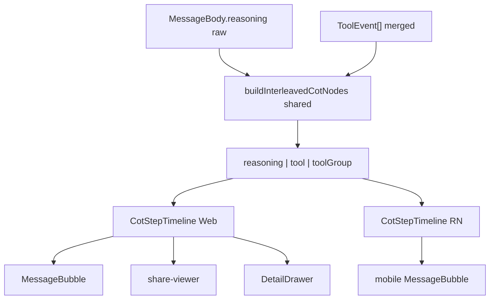

# 交错 CoT 步骤流四端重构

> 实施档案（工作区副本）：[`docs/superpowers/plans/2026-08-05-cot-interleaved-step-timeline.md`](docs/superpowers/plans/2026-08-05-cot-interleaved-step-timeline.md)  
> 目标视觉：参考图「深度思考 → 时间信息/联网检索 → 深度思考…」；**不是**「思考过程 + 工具调用 N 个」汇总双卡。

## 已锁定决策（自问自答）

1. **目标 UI**：交错步骤流；每段独立块；思考用灯/脑图标 +「深度思考」；工具用类型图标 + 中文名（可带查询副标题）；结果区可展开看结构化 JSON/文本。
2. **四端**：主聊天、分享、Battle 详情、Android **同一数据模型 + 同一节点构建器**；Web 用 React 组件，RN 用平行组件，禁止各端私有切分逻辑。
3. **废除主路径双卡**：主聊/分享不再并列渲染 `ReasoningSection` + `ToolCallsSection`；改单一 `CotStepTimeline`。Battle 去掉自研推理折叠 + 下方工具列表。Android 去掉纯「思考」文本框，改为步骤流。
4. **保留**：`ToolCallCard` 仅作步骤内「详情」弹层（Web）；`stripToolProgressFromReasoning` 继续净化展示段；工具进度仍不得写入 reasoning SSE。
5. **耗时**：无每段 duration 协议前，**不伪造**分段秒数。外层过程壳可显示消息级 `reasoningDurationSeconds`（有则「深度思考过程 · Ns」）；单步标题默认「深度思考」，不写假 `(1.2s)`。
6. **折叠**：整条过程一个外层折叠（「收起/展开」）；流式自动展开、完成默认折叠；localStorage 键 `aichat.cot_step_timeline_visibility`；单步结果默认折叠摘要、点击展开 JSON。
7. **分组**：同 offset 上 `web_search`/`read_url` 可合并为搜索组（复用旧 `useCoTTimeline` 规则）；其它工具一卡一事。
8. **正确性优先**：删除过时双卡主路径与文档描述；`CONTEXT.md` 改回「交错步骤流」为现行展示。

## 架构



节点构建必须对 **未 strip 的 raw reasoning** 做 offset 切片，再对每个 reasoning 节点文本 `stripToolProgressFromReasoning` 后展示。

参考已删实现（只取算法，不原样粘贴 660 行）：
- `git show bd01927^:packages/frontend/src/features/chat/tool-events/useCoTTimeline.ts`
- `git show bd01927^:packages/frontend/src/components/message-bubble/cot-timeline.tsx`

## 落地任务

### Task 1 — Shared：节点构建器 + 展示元数据（TDD）

**Files**
- Create: [`packages/shared/src/cot-timeline.ts`](packages/shared/src/cot-timeline.ts)
- Export: [`packages/shared/package.json`](packages/shared/package.json)、[`packages/shared/src/index.ts`](packages/shared/src/index.ts)
- Tests: [`packages/backend/src/modules/chat/__tests__/cot-timeline.test.ts`](packages/backend/src/modules/chat/__tests__/cot-timeline.test.ts)（或 shared 可跑的 jest 入口，与现有 strip 测试同模式）

**API（示意）**
```ts
type CotTimelineNode =
  | { type: 'reasoning'; text: string; charStart: number; charEnd: number }
  | { type: 'tool'; event: ToolEvent }
  | { type: 'toolGroup'; toolType: string; events: ToolEvent[]; summaryText: string; status: ToolCallStatus }

buildInterleavedCotNodes(reasoningRaw: string, events: ToolEvent[]): CotTimelineNode[]
resolveToolDisplay(tool: string): { label: string; iconKey: 'search' | 'globe' | 'clock' | 'file' | 'code' | 'wrench' | ... }
```

- 切分/orphan/合并规则对齐旧 `useCoTTimeline`
- `describeTool` 收敛到此处或由 `tool-events` 唯一导出，消灭 `tool-call-card` 重复表
- RN 安全：无 DOM

### Task 2 — Backend：全链路补全 offset

**Files**
- [`packages/backend/src/modules/chat/tool-log-manager.ts`](packages/backend/src/modules/chat/tool-log-manager.ts) 或 orchestrator 统一入口
- [`packages/backend/src/modules/chat/agent-web-search-response.ts`](packages/backend/src/modules/chat/agent-web-search-response.ts)
- 标准流 tool 路径（若独立于 agent）：确保 `sendToolEvent`/`record` 时带上当前 `reasoningBuffer.length`
- Tests：start → 有 `reasoningOffsetStart`；result/error → 有 `reasoningOffsetEnd`；落库 `toolLogsJson` 保留字段

规则：
- `stage=start`（或首次见到 callId）：写 `reasoningOffsetStart = reasoningBuffer.length`（若尚未写）
- `stage=result|error`：写 `reasoningOffsetEnd = reasoningBuffer.length`
- 所有 builtin/MCP/workspace 工具走同一记录点，避免只有 web_search 有 offset

### Task 3 — Web：`CotStepTimeline` 替换双卡主路径

**Files**
- Create: `packages/frontend/src/components/message-bubble/cot-step-timeline.tsx`（拆子组件：`CotReasoningStep`、`CotToolStep`，禁止单文件上千行）
- Modify: [`packages/frontend/src/components/message-bubble/index.tsx`](packages/frontend/src/components/message-bubble/index.tsx) — 删除并列 `ReasoningSection`/`ToolCallsSection`，改为 `useToolTimeline` + `buildInterleavedCotNodes` + `CotStepTimeline`
- Modify: [`packages/frontend/src/components/share/share-viewer.tsx`](packages/frontend/src/components/share/share-viewer.tsx)
- Modify: [`packages/frontend/src/features/battle/ui/DetailDrawer.tsx`](packages/frontend/src/features/battle/ui/DetailDrawer.tsx)
- Tests: 节点渲染、折叠、无工具仅推理、无推理仅工具、污染行不出现在思考步

视觉：
- 思考步：图标 +「深度思考」+ 正文（流式末段打字机）
- 工具步：类型图标 + `resolveToolDisplay().label`（搜索可拼 query）+ 可展开 `<pre>`/`resultJson`
- 外层过程壳：收起/展开 + 可选总耗时 + 工具计数

`ReasoningSection` / `ToolCallsSection`：主路径停用后，若无其它引用则删除；有则仅留死代码检查后删。

### Task 4 — Android：工具事件入状态 + RN 步骤流

**Files**
- [`packages/mobile/src/chat-types.ts`](packages/mobile/src/chat-types.ts) — message 增加 `toolEvents?: ToolEvent[]`（类型从 `@aichat/shared`）
- [`packages/mobile/src/screens/ChatScreen.tsx`](packages/mobile/src/screens/ChatScreen.tsx) / [`chat-message-utils.ts`](packages/mobile/src/screens/chat-message-utils.ts) — 消费 `tool_call` chunk，merge 进当前 assistant 消息（复用 shared `mergeAndSortToolEvents`）
- Create: `packages/mobile/src/screens/CotStepTimeline.tsx`
- Modify: [`packages/mobile/src/screens/MessageBubble.tsx`](packages/mobile/src/screens/MessageBubble.tsx) — 用 `buildInterleavedCotNodes` + RN 步骤 UI
- 历史消息：若 API 已返回 `toolEvents`/`toolLogs`，加载会话时灌入；若移动端列表 API 尚无字段，补齐与 web 一致的字段映射（backend message serialize）
- Tests: parser/utils 合并 tool 事件；bubble 有工具时渲染步骤标题

### Task 5 — 清理与文档

- 更新 [`CONTEXT.md`](CONTEXT.md)：CoT = 交错步骤流；Reasoning Offset 恢复为「交错展示用」；删除「双独立折叠区块为现行」措辞
- 更新 [`CHANGELOG.md`](CHANGELOG.md)：BREAKING UI — 推理/工具改为交错步骤流；废除汇总双卡主路径
- 标注旧计划 [`docs/superpowers/plans/2026-08-04-cot-tool-call-split.md`](docs/superpowers/plans/2026-08-04-cot-tool-call-split.md) 为 SUPERSEDED by 本文件
- `grep` 确认主路径无 `ReasoningSection`+`ToolCallsSection` 并列；无工具进度 `emitReasoning`

### Task 6 — 验证与合入

- shared/backend jest；frontend vitest；mobile 相关 test
- code-review → 合 main → 盯镜像 CI；Android 若有单独 workflow 一并盯

## 明确不做

- 不恢复把工具进度 `emitReasoning` 进 reasoning
- 不引入假分段耗时协议（除非另开任务）
- 不保留「思考过程 / 工具调用 N 个」作为主聊默认 UI
