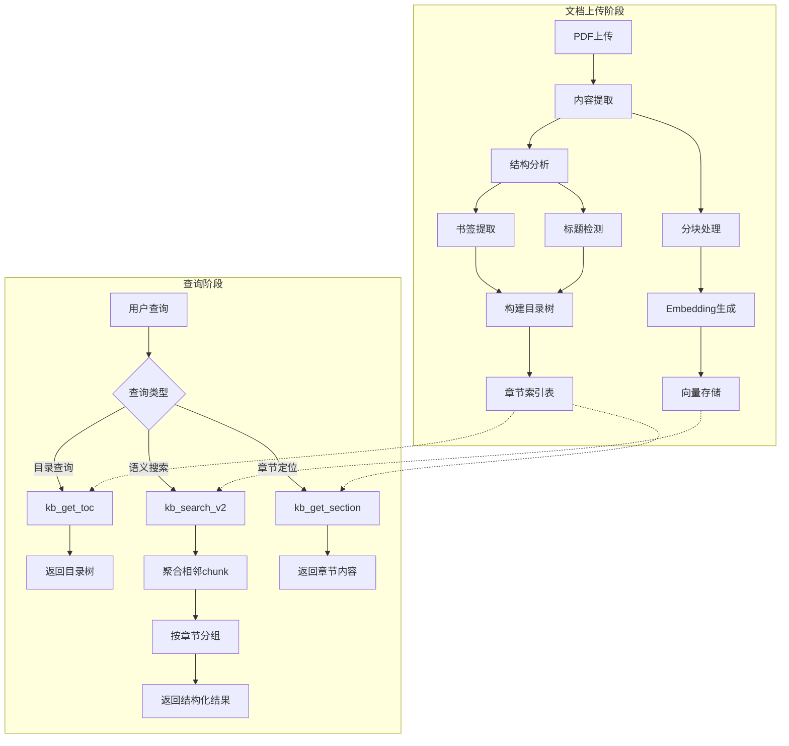

# RAG 知识库文档系统优化方案

> 基于实际使用日志分析和代码审查的系统性优化设计

## ✅ 实施状态：已完成 (2025-12-25)

已完成的代码变更：
- `packages/backend/prisma/schema.prisma` - 添加 DocumentSection 模型
- `packages/backend/prisma/migrations/20251225000000_add_document_sections/migration.sql` - 数据库迁移
- `packages/backend/src/modules/document/structure/` - 文档结构提取模块
- `packages/backend/src/services/document/section-service.ts` - 章节服务
- `packages/backend/src/services/document/enhanced-rag-service.ts` - 增强RAG服务
- `packages/backend/src/modules/chat/kb-tools.ts` - 新增3个工具
- `packages/backend/scripts/migrate-document-sections.ts` - 迁移脚本

---

## 一、问题诊断

### 1.1 问题现象（来自用户日志）

| 指标 | 日志1 (TDO查询) | 日志2 (MDO查询) |
|------|-----------------|-----------------|
| kb_list 调用 | 1次 | 1次 |
| kb_search 调用 | 10次 | 5次 |
| kb_get_documents 调用 | 1次 | 1次 |
| kb_get_document_content 调用 | 14次 | 4次 |
| **总计** | **26次** | **11次** |
| 失败次数 | 3次 | 0次 |

**核心问题**：简单查询需要大量工具调用，搜索结果碎片化，需要靠猜测翻页定位内容。

### 1.2 根因分析

通过代码审查，诊断出4层问题：

```
┌─────────────────────────────────────────────────────────────────┐
│  用户查询: "TDO安全操作规程"                                      │
└─────────────────────────────────────────────────────────────────┘
                              ↓
┌─────────────────────────────────────────────────────────────────┐
│  问题1: 工具层 (kb-tools.ts)                                     │
│  - kb_search 返回160个零碎片段                                   │
│  - headings模式只是简单过滤短行，不是真正的标题提取               │
│  - 缺少 kb_get_toc 获取目录结构的工具                            │
└─────────────────────────────────────────────────────────────────┘
                              ↓
┌─────────────────────────────────────────────────────────────────┐
│  问题2: 搜索层 (rag-service.ts)                                  │
│  - 返回独立的 chunk，没有上下文聚合                              │
│  - 相邻 chunk 不会合并                                           │
│  - overview模式只按页面位置采样，不是按主题聚合                  │
└─────────────────────────────────────────────────────────────────┘
                              ↓
┌─────────────────────────────────────────────────────────────────┐
│  问题3: 存储层 (knowledge-base-service.ts)                       │
│  - chunk.metadata 只存 pageNumber                                │
│  - 没有章节关联信息                                              │
│  - 无法按章节检索                                                │
└─────────────────────────────────────────────────────────────────┘
                              ↓
┌─────────────────────────────────────────────────────────────────┐
│  问题4: 文档处理层 (pdf-loader.ts)                               │
│  - 只提取 pageContent 和 pageNumber                              │
│  - 没有提取 PDF 书签/大纲                                        │
│  - 没有识别标题/章节结构                                         │
└─────────────────────────────────────────────────────────────────┘
```

### 1.3 代码证据

**证据1**: [`pdf-loader.ts:100-107`](../packages/backend/src/modules/document/loaders/pdf-loader.ts)
```typescript
const content: DocumentContent = {
  pageContent: pageText,
  metadata: {
    source: filename,
    filePath,
    pageNumber: currentPageNumber,  // ← 只有页码，没有章节信息
  },
}
```

**证据2**: [`kb-tools.ts:508-518`](../packages/backend/src/modules/chat/kb-tools.ts)
```typescript
if (sampleMode === 'headings') {
  // ← 这不是真正的标题提取，只是过滤短行
  const headings = lines.filter((line) => {
    const trimmed = line.trim()
    return trimmed.length < 60 && trimmed.length > 2
  })
}
```

**证据3**: [`knowledge-base-service.ts:534-547`](../packages/backend/src/services/knowledge-base/knowledge-base-service.ts)
```typescript
// ← chunk只存储pageNumber，没有章节索引
return {
  pageNumber: typeof meta.pageNumber === 'number' ? meta.pageNumber : null,
}
```

---

## 二、优化方案设计

### 2.1 整体架构



### 2.2 模块设计

#### 模块1: 文档结构提取器

**文件**: `packages/backend/src/modules/document/structure/pdf-structure-extractor.ts`

```typescript
interface DocumentSection {
  id: string;
  documentId: number;
  parentId: string | null;
  level: number;          // 1=章, 2=节, 3=小节
  title: string;
  path: string;           // 如 "1.2.3"
  startPage: number;
  endPage: number;
  startChunk: number;
  endChunk: number;
  children: DocumentSection[];
}

interface StructureExtractionResult {
  toc: DocumentSection[];
  hasPdfOutline: boolean;
  detectionMethod: 'pdf_outline' | 'heuristic' | 'none';
}

class PDFStructureExtractor {
  // 从PDF书签提取目录
  async extractFromOutline(pdfPath: string): Promise<DocumentSection[]>;
  
  // 启发式检测标题 (基于字体大小、编号格式)
  async detectHeadings(chunks: Chunk[]): Promise<DocumentSection[]>;
  
  // 合并两种方法的结果
  async extract(pdfPath: string, chunks: Chunk[]): Promise<StructureExtractionResult>;
}
```

**提取策略优先级**:
1. PDF 书签/大纲 (最可靠)
2. 启发式标题检测:
   - 数字编号开头: `1.`, `1.1`, `第一章`
   - 独立短行 (< 80字符)
   - 与上下文有明显分隔

#### 模块2: 数据库扩展

**新增表**: `document_sections`

```sql
CREATE TABLE document_sections (
  id TEXT PRIMARY KEY,
  document_id INTEGER NOT NULL REFERENCES documents(id) ON DELETE CASCADE,
  parent_id TEXT,
  level INTEGER NOT NULL DEFAULT 1,
  title TEXT NOT NULL,
  path TEXT NOT NULL,
  start_page INTEGER,
  end_page INTEGER,
  start_chunk INTEGER,
  end_chunk INTEGER,
  title_embedding BLOB,
  created_at DATETIME DEFAULT CURRENT_TIMESTAMP,
  
  INDEX idx_document_id (document_id),
  INDEX idx_path (path)
);
```

**Prisma Schema 扩展**:
```prisma
model DocumentSection {
  id             String    @id @default(cuid())
  documentId     Int
  document       Document  @relation(fields: [documentId], references: [id], onDelete: Cascade)
  parentId       String?
  parent         DocumentSection? @relation("SectionHierarchy", fields: [parentId], references: [id])
  children       DocumentSection[] @relation("SectionHierarchy")
  level          Int       @default(1)
  title          String
  path           String
  startPage      Int?
  endPage        Int?
  startChunk     Int?
  endChunk       Int?
  titleEmbedding Bytes?
  createdAt      DateTime  @default(now())

  @@index([documentId])
  @@index([path])
}
```

#### 模块3: 增强搜索服务

**文件**: `packages/backend/src/services/document/enhanced-rag-service.ts`

```typescript
interface EnhancedSearchOptions {
  mode: 'precise' | 'broad' | 'section';
  aggregateAdjacent: boolean;     // 合并相邻chunk
  groupBySection: boolean;        // 按章节分组
  includeContext: boolean;        // 包含上下文
  contextSize: number;            // 上下文大小
}

interface EnhancedRAGHit {
  // 基础字段
  documentId: number;
  documentName: string;
  content: string;
  score: number;
  
  // 新增: 结构信息
  section?: {
    id: string;
    title: string;
    path: string;
    level: number;
  };
  
  // 新增: 聚合信息
  aggregatedFrom?: number[];      // 合并的chunk索引
  contextBefore?: string;
  contextAfter?: string;
}

interface SectionSearchResult {
  section: DocumentSection;
  relevanceScore: number;
  matchedChunks: number;
  preview: string;
}

class EnhancedRAGService {
  // 语义搜索 + 章节聚合
  async search(
    documentIds: number[],
    query: string,
    options: EnhancedSearchOptions
  ): Promise<EnhancedRAGResult>;
  
  // 按章节搜索
  async searchSections(
    documentIds: number[],
    query: string
  ): Promise<SectionSearchResult[]>;
  
  // 获取章节完整内容
  async getSectionContent(
    sectionId: string
  ): Promise<string>;
}
```

**相邻chunk聚合算法**:
```typescript
function aggregateAdjacentChunks(hits: RAGHit[]): EnhancedRAGHit[] {
  // 按文档分组
  const byDocument = groupBy(hits, 'documentId');
  
  const result: EnhancedRAGHit[] = [];
  
  for (const [docId, docHits] of Object.entries(byDocument)) {
    // 按chunk索引排序
    docHits.sort((a, b) => a.chunkIndex - b.chunkIndex);
    
    // 合并相邻chunk (索引差 <= 1)
    let current: EnhancedRAGHit | null = null;
    
    for (const hit of docHits) {
      if (!current) {
        current = { ...hit, aggregatedFrom: [hit.chunkIndex] };
      } else if (hit.chunkIndex - current.aggregatedFrom!.at(-1)! <= 1) {
        // 相邻，合并
        current.content += '\n' + hit.content;
        current.score = Math.max(current.score, hit.score);
        current.aggregatedFrom!.push(hit.chunkIndex);
      } else {
        // 不相邻，保存当前，开始新的
        result.push(current);
        current = { ...hit, aggregatedFrom: [hit.chunkIndex] };
      }
    }
    
    if (current) result.push(current);
  }
  
  return result;
}
```

#### 模块4: 新增知识库工具

**新增工具定义**:

```typescript
// 1. 获取文档目录
{
  name: 'kb_get_toc',
  description: `获取文档的目录结构。
  
**使用场景**:
- ✅ 了解文档整体结构
- ✅ 定位特定章节
- ✅ 在查看内容前先了解文档组织

**返回信息**:
- 层级目录树
- 每个章节的页码范围
- 章节路径 (如 "1.2.3")`,
  parameters: {
    document_id: { type: 'integer', required: true },
    max_level: { type: 'integer', description: '最大展示层级，默认3' }
  }
}

// 2. 按章节获取内容
{
  name: 'kb_get_section',
  description: `获取指定章节的完整内容。
  
**使用场景**:
- ✅ 已知章节路径，需要完整内容
- ✅ 获取特定章节的所有子章节
- ✅ 比按页码获取更精准`,
  parameters: {
    document_id: { type: 'integer', required: true },
    section_path: { type: 'string', description: '章节路径如 "1.2.3" 或章节标题' },
    include_children: { type: 'boolean', default: true }
  }
}

// 3. 增强版搜索
{
  name: 'kb_search_v2',
  description: `在知识库中进行语义搜索，返回按章节聚合的结果。
  
**相比 kb_search 的改进**:
- 相邻内容自动合并，不再碎片化
- 结果按章节分组
- 返回章节上下文

**搜索模式**:
- "precise": 精确匹配，高相关性
- "broad": 广泛检索，覆盖更多内容
- "section": 按章节聚合，返回完整章节`,
  parameters: {
    query: { type: 'string', required: true },
    search_mode: { type: 'string', enum: ['precise', 'broad', 'section'] },
    aggregate_adjacent: { type: 'boolean', default: true }
  }
}
```

### 2.3 处理流程对比

**当前流程**:
```
用户问: "TDO安全操作规程"
  ↓
kb_search("TDO安全操作规程") → 160个碎片
  ↓
AI猜测: 可能在第66页? → kb_get_document_content(page=66)
  ↓
内容不完整 → kb_get_document_content(page=67, 68...)
  ↓
反复尝试... 总计26次调用
```

**优化后流程**:
```
用户问: "TDO安全操作规程"
  ↓
kb_get_toc(doc_id) → 返回目录，AI看到 "第14章 TDO操作"
  ↓
kb_get_section(section="14") → 返回完整章节内容
  ↓
完成! 总计2-3次调用
```

---

## 三、实施计划

### 3.1 阶段划分

| 阶段 | 内容 | 文件变更 | 风险 |
|------|------|----------|------|
| **Phase 1** | 数据库扩展 + 结构提取 | prisma/schema.prisma, pdf-structure-extractor.ts | 低 |
| **Phase 2** | 文档处理流程集成 | document-worker.ts, pdf-loader.ts | 中 |
| **Phase 3** | 搜索服务增强 | enhanced-rag-service.ts, rag-service.ts | 中 |
| **Phase 4** | 新增知识库工具 | kb-tools.ts | 低 |
| **Phase 5** | 向后兼容 + 迁移 | migration脚本 | 低 |

### 3.2 Phase 1: 数据库扩展

**新增文件**:
- `packages/backend/prisma/migrations/xxx_add_document_sections.sql`

**修改文件**:
- `packages/backend/prisma/schema.prisma` - 添加 DocumentSection 模型

**验收标准**:
- [ ] 数据库迁移成功
- [ ] Prisma Client 正常生成

### 3.3 Phase 2: 结构提取

**新增文件**:
- `packages/backend/src/modules/document/structure/pdf-structure-extractor.ts`
- `packages/backend/src/modules/document/structure/heading-detector.ts`
- `packages/backend/src/modules/document/structure/index.ts`

**修改文件**:
- `packages/backend/src/workers/document-worker.ts` - 集成结构提取步骤
- `packages/backend/src/modules/document/loaders/pdf-loader.ts` - 提取PDF大纲

**验收标准**:
- [ ] 能提取PDF书签目录
- [ ] 能启发式检测标题
- [ ] 结构数据正确存储

### 3.4 Phase 3: 搜索增强

**新增文件**:
- `packages/backend/src/services/document/enhanced-rag-service.ts`

**修改文件**:
- `packages/backend/src/services/document/rag-service.ts` - 添加聚合逻辑

**验收标准**:
- [ ] 相邻chunk正确合并
- [ ] 按章节分组返回
- [ ] 性能无明显下降

### 3.5 Phase 4: 工具扩展

**修改文件**:
- `packages/backend/src/modules/chat/kb-tools.ts` - 添加新工具

**验收标准**:
- [ ] kb_get_toc 返回正确目录树
- [ ] kb_get_section 返回完整章节
- [ ] kb_search_v2 结果不再碎片化

### 3.6 Phase 5: 迁移与兼容

**新增文件**:
- `packages/backend/scripts/migrate-document-sections.ts` - 为现有文档生成目录索引

**验收标准**:
- [ ] 现有知识库文档自动生成目录索引
- [ ] 旧版 kb_search 仍可用
- [ ] 无破坏性变更

---

## 四、预期效果

### 4.1 效率提升

| 场景 | 当前调用次数 | 优化后调用次数 | 提升 |
|------|-------------|----------------|------|
| 查找特定章节内容 | 10-15次 | 2-3次 | 70-80% |
| 获取安全操作规程 | 20-26次 | 3-5次 | 75-85% |
| 了解文档结构 | 5-10次 | 1次 | 80-90% |

### 4.2 用户体验改善

- **不再需要猜测页码**: 通过目录直接定位
- **搜索结果连贯**: 相邻内容自动合并
- **章节上下文完整**: 不再是孤立片段
- **支持大规模知识库**: 即使100+文档也能快速定位

---

## 五、备选方案

如果完整方案实施周期过长，可考虑**轻量级优化**:

### 5.1 快速优化（1-2天可完成）

1. **相邻chunk合并** (仅修改 rag-service.ts)
   - 搜索结果按文档分组
   - 相邻chunk自动合并
   - 无需数据库变更

2. **改进headings模式** (仅修改 kb-tools.ts)
   - 使用正则检测编号标题
   - 提取更准确的标题行

3. **增加上下文窗口** (仅修改 rag-service.ts)
   - 搜索命中后，额外获取前后1个chunk
   - 返回更完整的上下文

### 5.2 中期优化（1周可完成）

在快速优化基础上增加:
- PDF书签提取
- 目录索引表
- kb_get_toc 工具

---

## 六、总结

本优化方案通过在文档处理阶段提取结构化信息，并在搜索阶段进行智能聚合，解决了当前RAG系统的两个核心问题：

1. **缺乏文档结构索引** → 新增目录提取和章节索引
2. **搜索结果碎片化** → 相邻chunk聚合 + 章节分组

预期可将工具调用次数减少 70-85%，显著提升用户获取信息的效率。